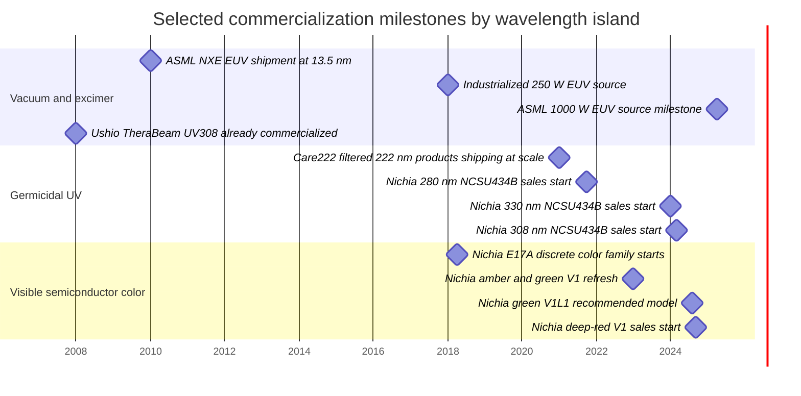

# Current light-emitting sources from 13.5 nm to 1500 nm

## Executive summary

From 13.5 nm to 1500 nm, there is no single emitter technology that covers the whole span. Instead, the modern landscape is segmented. At the shortest wavelengths, practical sources are almost entirely vacuum-system sources such as tin-plasma extreme ultraviolet (EUV, extreme ultraviolet) sources, synchrotrons, and free-electron lasers (FELs, accelerators whose electron beam radiates tunable laser light). In the ultraviolet (UV) below roughly 330 nm, excimer lamps and excimer lasers remain the most mature high-power solutions, while aluminum gallium nitride (AlGaN) LEDs are commercially real but still power- and efficiency-limited. In the human-visible band there is effectively continuous practical coverage, but it is achieved by combining direct LEDs and laser diodes with broader emitters such as phosphors, quantum dots (QDs, semiconductor nanocrystals whose emission wavelength depends on size/composition), and OLEDs (organic light-emitting diodes). From about 730 nm into the near-infrared (NIR, near infrared), direct semiconductor emitters again dominate, with mature LEDs, laser diodes, superluminescent diodes (SLDs, high-brightness broadband semiconductor emitters), and telecom-class distributed-feedback lasers. citeturn13search5turn12search1turn14search3turn15search1turn17search0turn30search4turn38search4turn39search14

The visible range, 380–720 nm, is the densest and most commercially mature part of the spectrum. Exact narrow-band semiconductor sources exist at many anchor wavelengths, especially around 405 nm, 445–488 nm, 515–532 nm, 590 nm, 625–660 nm, and 730 nm. However, not every exact nanometer in the visible has a mass-produced narrow-line compact point source. Continuous perceptual coverage is instead filled by broad-band emitters and conversion architectures: phosphors span broad yellow-red regions, QD emitters and QD color converters can be tuned from green to red with relatively narrow full width at half maximum (FWHM, the width of the spectral peak measured at half the peak intensity), and OLED emitters now cover deep blue through red with either broad commercial RGB subpixel spectra or much narrower research-grade multi-resonance / hyperfluorescent devices. citeturn24view0turn7view6turn8view2turn8view0turn7view0turn39search15turn36view0turn11search9turn11search6turn11search3turn10search13turn10search3

The shortest practically industrial wavelength in mainstream manufacturing remains 13.5 nm for EUV lithography. ASML reports this wavelength as the basis of its EUV platform, and its 2025 annual report states that a 1000 W EUV light source milestone was demonstrated in April 2025. In contrast, between roughly 14 nm and 156 nm there is no compact, mass-produced, general-purpose bench emitter comparable to a visible LED or laser diode; coverage there is dominated by beamline and excimer technologies because absorption in air and most materials becomes severe and vacuum optics are required. citeturn12search6turn13search12turn13search7turn13search3turn12search1

A central practical conclusion is that “no known emitter” is rare if one allows large facilities and broad/tunable sources, but it is still meaningful for **compact, efficient, mass-produced narrowband devices** at some wavelengths. The strongest modern gaps are below about 230 nm for semiconductor LEDs, where primary literature still describes far-UVC LEDs around 210–225 nm as research-stage devices with low power and difficult materials physics, and near the visible/NIR boundary around 705–720 nm, where commercial narrowband offerings thin out and broad tails or nearby 705 nm laser / 720–740 nm far-red LED bins are more common than exact-wavelength production parts. citeturn41search1turn41search2turn41search5turn41search18turn39search1turn9view0

## Scope and method

This report prioritizes primary and official sources: manufacturer product pages, formal datasheets, annual reports, and peer-reviewed papers. For each wavelength or narrow band, the table records the exact center wavelength when an official source provides one; otherwise it records the best-supported narrow band or chromaticity-mapped region. “Bandwidth” is reported as FWHM when available; for laser diodes, some vendor pages instead emphasize linewidth or single-frequency operation, and I state that explicitly. “Power efficiency” is reported as wall-plug efficiency (WPE, optical power divided by electrical input power) or external quantum efficiency (EQE, photons emitted externally per injected electron, usually stated for OLEDs and QLEDs) where the source provides it or where it can be inferred directly from a single datasheet operating point. For visible LEDs, manufacturers often publish luminous flux in lumens rather than radiant watts; where that happens, I preserve the official unit rather than over-convert it. The photometric basis for relating visible radiant and luminous quantities is the CIE photopic luminous-efficiency function V(λ), formally tabulated at 1 nm spacing. citeturn42search0turn42search8

“Commercial status” is normalized to four buckets. “Early research” means peer-reviewed demonstrations without obvious catalog scale. “Commercial samples” means purchasable but clearly emerging or niche parts. “Full production” means active catalog products or large-scale industrial deployment. “Facility source” means a large infrastructure source such as a synchrotron or FEL rather than a packaged component. Those labels are analytical judgments built on the cited product status fields, launch dates, and facility descriptions. citeturn21search0turn21search1turn21search3turn30search2turn30search3turn12search1turn13search3

A final methodological note: the user asked for single-nanometer resolution “where possible” and allowed grouped contiguous regions. That is exactly how the visible section is handled here. I group only where the same practical answer repeats: for example, broad phosphor/QD/OLED coverage over a continuous span, or a direct-semiconductor family whose nearest official bins define the whole interval. If a wavelength interval has no well-supported compact emitter in current production, I say so explicitly and explain why. citeturn10search2turn11search5turn11search6turn10search3turn41search1

## Coverage map across the spectrum

The table below is the shortest useful “map” before the detailed wavelength-indexed tables.

| Spectral band | Practical coverage conclusion | Dominant current source classes | Commercial maturity |
|---|---|---|---|
| 13.5 nm | Exact industrial line exists; unique mainstream lithography wavelength | tin laser-produced plasma EUV, synchrotron, FEL | full production for lithography; facility-class otherwise citeturn12search6turn13search3turn12search1 |
| ~14–156 nm | No compact mass-market packaged emitters identified in this survey; mostly vacuum/facility domain | synchrotron, FEL; specialized VUV/EUV gas/plasma sources | facility / niche industrial citeturn12search1turn12search6 |
| 157–308 nm | Mature exact-line industrial sources exist at specific excimer wavelengths | F2, ArF, KrF, XeCl excimer lasers; Xe excimer lamps; mercury lamps; research/commercial UV LEDs above ~250 nm | full production for excimer/lamp lines; LEDs mixed from research to commercial citeturn14search3turn14search5turn15search1turn16search0turn17search5turn17search0turn20search0 |
| 330–405 nm | Strong commercial UV-A ecosystem | AlGaN / InGaN UV LEDs, violet laser diodes | full production citeturn21search3turn24view0turn25search0turn26search0turn37search4 |
| 380–720 nm | Continuous practical coverage, but by multiple classes; exact compact narrow lines cluster at favored bins | visible LEDs, laser diodes, DPSS lasers, OLEDs, QLEDs, phosphors | overwhelmingly full production; some narrowband OLED/QLED entries still research-stage citeturn30search4turn37search0turn39search15turn11search9turn11search6turn11search3 |
| 721–1100 nm | Dense semiconductor coverage | far-red / IR LEDs, VCSELs, laser diodes, broadband IR emitters, SLDs | full production citeturn9view0turn38search4turn38search10turn39search1 |
| 1101–1500 nm | Mostly telecom / sensing / OCT-class semiconductor sources | DFB lasers, FBG-stabilized lasers, SLDs, specialty LEDs | full production in telecom and instrumentation niches citeturn39search14turn39search29turn40search7turn40search1 |

## Wavelength-indexed table for visible coverage

The visible table is organized by narrow intervals but preserves exact wavelengths whenever the primary source gives them. “Output” is reported in the unit the primary source actually uses: radiant flux/power for radiometric products, luminous flux for visible indicator/lighting LEDs, and luminance/EQE for OLED/QLED display emitters.

| Visible band or center | Exact center(s) and representative emitter(s) | Bandwidth | Typical output | Efficiency | Mechanism / material | Commercial status and form factor | Representative primary sources |
|---|---|---|---|---|---|---|---|
| 380–389 nm | 385 nm UV-A LEDs are abundant; practical visible-edge coverage is usually realized by 385 nm semiconductor LEDs rather than exact 380–384 nm narrow-line parts | 11 nm FWHM for Nichia 385 nm UV-A LED family | 1.45–1.73 W radiant flux typical at 700–1000 mA, depending on package generation | ~47% WPE for Nichia NVSU233B at 385 nm, inferred from 1.73 W out at 3.70 V, 1 A | AlGaN / InGaN UV-A LED | full production; 3.5×3.5 mm and 6.8×6.8 mm ceramic/SMD UV packages | Nichia NVSU119C/NVSU233B datasheets and product pages citeturn26search0turn24view0turn17search1 |
| 390–404 nm | 395 nm and 405 nm violet sources are dense; this interval is also where direct diodes start to overlap the visible market | 11–12 nm FWHM for 395/405 nm LEDs; laser-diode linewidth is much narrower and vendor-page dependent | 1.42–1.65 W radiant flux typical for Nichia 395 / 405 nm LEDs; visible LD catalogs extend down to 404–405 nm | ~45% WPE for 395–405 nm Nichia high-power LEDs, inferred from datasheet points | InGaN LED; GaN laser diode | full production; SMD UV packages and TO-can / pigtailed laser-diode packages | Nichia NVSU119C and NVSU233C datasheets; Thorlabs visible laser-diode catalog range 404–690 nm citeturn26search0turn25search0turn37search0turn37search4 |
| 405 nm | 405 nm exact anchor: violet LED and laser diode | 12 nm FWHM for Nichia U405 LED; compact laser modules available from 405 to 1550 nm | LED: 1.42–1.61 W radiant flux at 700–1000 mA. Laser modules: 4–20 mW class for compact modules | LED WPE about 45% from datasheet point; laser-module WPE not publicly summarized on the product overview page | InGaN quantum-well LED; GaN laser diode | full production; 3.5×3.5 mm SMD LED, TO-can and threaded compact laser modules | Nichia U405 LED datasheets; Thorlabs compact laser modules overview citeturn26search0turn25search0turn39search25 |
| 440–455 nm | Direct semiconductor coverage is strongest here: 445 nm laser diodes and 450 nm deep-blue LEDs | LED FWHM not stated in the cited horticulture family snippet; blue LDs are narrow-line devices | Nichia 445 nm laser diode: 500 mW CW typical. Deep-blue horticulture LEDs at 450 nm are catalog products in the same family as 640/660/730 nm plant-light emitters | Nichia 445 nm LD WPE about 29% at the stated operating point | GaN laser diode; InGaN LED | full production; TO-can laser diode and horticulture LED packages | Nichia NDB4816 laser-diode datasheet; ams OSRAM OSCONIQ P horticulture datasheet | citeturn7view3turn7view4turn7view5turn5search7 |
| 460–480 nm | Strong blue coverage from LEDs and lasers; 470 nm is a standard LED bin and 473 nm is a common fiber-coupled laser wavelength | 22 nm FWHM for ams OSRAM blue 470 nm LED; laser linewidth depends on mode | Blue LED example: 470 nm dominant wavelength, ~0.133 lm typical at 5 mA in mini package. Fiber-coupled 473 nm laser source: 50 mW | Mini blue LED luminous efficacy is not stated directly; laser-module WPE not stated on page | InGaN LED; diode-pumped/fiber-coupled blue laser systems | full production; 0603 mini-LEDs and fiber-coupled benchtop or module lasers | ams OSRAM LB Q39G datasheet; Thorlabs fiber-coupled visible laser source page citeturn7view6turn7view7turn9view4turn39search24 |
| 488–505 nm | 488 nm laser line and 505 nm cyan/verde-green LED coverage make this interval practical even though it is less dense than 445–470 nm | 488 nm LD/SLD lines are narrow; 505 nm LED bins are typically broader | 488 nm pigtailed LDs are offered in 20 mW class; 505 nm LED bins are cataloged in multiple ams OSRAM families | Not publicly summarized as WPE on the cited catalog pages | InGaN laser diode; cyan-green InGaN LED | commercial samples to full production depending packaging; pigtailed LDs and SMT LEDs | Thorlabs pigtailed single-mode laser diodes; ams OSRAM datasheets listing 505 nm “verde green” bins citeturn37search17turn5search8turn5search14 |
| 510–520 nm | Exact green laser anchor at 515 nm; direct LED and OLED/QLED coverage begins to overlap strongly | Nichia 515 nm LD is narrow; research OLED/QLED green devices in this region are 29–33 nm FWHM class | Nichia 515 nm LD: 150 mW CW typical. Research pure-green OLEDs and QLEDs: high luminance with EQE up to ~29.5% for OLEDs and 15.2% for InP QLEDs | 515 nm LD WPE about 11% at the datasheet operating point; OLED/QLED by EQE instead of WPE | InGaN laser diode; organic hyperfluorescence / TADF OLED; InP-based QLED | laser diode full production; narrow pure-green OLED/QLED still early research, though commercial displays use broader green subpixels | Nichia NDG4716; Nature/Light papers on 526–538 nm OLEDs and 532 nm InP QLEDs citeturn7view0turn7view1turn7view2turn11search9turn10search13 |
| 521–540 nm | Commercial green LEDs are mature; this is also one of the best-served display colors for QD and OLED emitters | 30 nm FWHM for ams OSRAM 530 nm green LED; 29–33 nm FWHM for narrowband green OLEDs; 32 nm for flexible green QDLED example | Green LED example: 150–210 lm at 350 mA for Nichia NCSGE17A-V1L1. Narrowband green OLEDs at 526–538 nm reach EQE up to 29.48%; flexible green QDLED example emits at 526 nm | LEDs usually specified by lumens; OLED/QLED efficiency reported as EQE, not WPE | InGaN green LED; multi-resonance and hyperfluorescent OLED; QDLED | LEDs full production; narrow-P3/Rec.2020-class OLED/QLED emitters still partly research-stage | Nichia NCSGE17A-V1L1; ams OSRAM LT Q39E; Nature papers on green OLED/QDLEDs citeturn33view3turn8view2turn11search9turn11search12 |
| 541–579 nm | Compact direct emitters exist, but the interval is often filled more gracefully by phosphors, lime LEDs, and green-yellow OLED/QD emitters; exact narrowband laser coverage is thinner than in blue/red | Broad by nature: phosphor yellow peaks around 565–585 nm; OLED/QD can be designed over this space | Nichia lime/green and phosphor-converted architectures fill this band; phosphor patents cite yellow emission peaks ~565–585 nm | Not normally expressed as WPE at the phosphor-material level | phosphor down-conversion, lime LEDs, green-yellow OLED/QD | full production for phosphor-converted lighting and displays; research for ultra-narrow specialty emitters | Nichia product search discrete color families and phosphor patent literature citeturn30search9turn10search3turn10search15 |
| 580–589 nm | Amber and yellow LEDs are mature; exact-wavelength compact sources are usually LED bins rather than laser diodes | 18 nm FWHM for ams OSRAM 590 nm yellow LED | 121–141 lm at 350 mA for Nichia amber V1 family; older ams OSRAM yellow example 4.8–15.2 lm at 50 mA depending bin | Visible amber LED data are usually given as lumens; datasheet thermal model for LY E6SF uses ηe = 9% in its electrical thermal-resistance note | AlInGaP amber/yellow LED; phosphor tail also covers interval | full production; 1.7×1.7×0.35 mm direct-mount chip LEDs and PLCC/TOPLED style packages | Nichia NCSAE17A-V1 and ams OSRAM LY E6SF | citeturn33view4turn8view0turn8view1 |
| 590–599 nm | Amber/orange edge; direct LEDs and broad OLED/phosphor emitters dominate | 18 nm FWHM for yellow/amber LED example | As above for amber families; exact 597 nm peak is common for yellow LED spectra | See previous row | AlInGaP LED; converters | full production | ams OSRAM LY E6SF and Nichia amber family citeturn8view0turn33view4 |
| 600–619 nm | Orange-red OLED/QLED emitters are strong here, even where direct narrow-line semiconductors are less common | Red OLED example: 33–38 nm FWHM at 612–614 nm; many orange LEDs broader | Red OLEDs in this band reached maximum EQE 21.9% and luminance to 265,000 cd/m² in the cited 2025 work | EQE up to 21.9% reported | copper(I)-sensitized fluorescence OLEDs and related organic emitters | early research for this narrow high-performance OLED recipe; commercial OLED displays also emit in this neighborhood but with different spectra | Nature Communications red OLED paper citeturn11search6 |
| 620–639 nm | Commercial red narrowband anchors are extremely mature: brilliant-red LEDs, red QDLEDs, and 638 nm laser diodes | QDLED: 21 nm FWHM at 630 nm; red LEDs broader; 638 nm diode lasers are narrow-line devices | Nichia brilliant-red direct-mount LED family gives 52–67 lm at 350 mA for the R021 rank and 60 lm typical at the nominal chromaticity point; 630 nm patterned CdSe/ZnS QD emitters show narrow 21 nm FWHM; 638 nm commercial laser-diodes are available in 40 mW class | QDLED efficiency not summarized in the snippet; laser WPE not summarized on catalog page | phosphor-assisted red LED family, CdSe/ZnS QD emitter, red laser diode | LEDs and red laser diodes full production; patterned high-PPI QD emitters still near leading-edge commercialization / research | Nichia NCSRE17A-V1; 2026 high-resolution QDLED paper; Thorlabs visible LD range page citeturn36view0turn11search3turn37search0 |
| 640–649 nm | 640 nm red LEDs are common in horticulture and signaling; narrow-line 642 nm class lasers are standard in instrumentation | Direct LEDs broader; laser diodes narrow-line | ams OSRAM horticulture family explicitly offers 640 nm red; Thorlabs four-channel source includes 642 nm single-frequency options and 638 nm / 642 nm channels | Power depends heavily on package: tens of mW for fiber-coupled instruments, far higher for horticulture LED arrays | AlInGaP red LED; single-frequency / Fabry-Perot diode lasers | full production; horticulture packages, fiber-coupled modules, TO cans | ams OSRAM GW PUSRA1.HW and Thorlabs multi-channel source pages citeturn5search7turn37search8 |
| 650–669 nm | Deep-red LEDs and QD/OLED emitters remain strong; exact 660 nm is one of the most mature plant-lighting wavelengths | 18 nm FWHM for an ams OSRAM red LED example; QD/OLED linewidth varies | ams OSRAM hyper-red 660 nm and Nichia deep-red families are catalog products; Nichia deep-red direct-mount part gives 24 lm at 350 mA and chromaticity near the deep-red edge; flexible red QDLED example peaks at 631 nm with 34 nm FWHM | Radiometric plant-lighting parts often emphasize radiant flux rather than lumens; visible red lighting parts often use lumens | AlInGaP deep-red LED; QDLED; OLED | full production for LEDs; mixed research/commercial maturity for specialty QD/OLED emitters | Nichia NCSRE17A-V1 deep red, ams OSRAM hyper-red documentation, flexible QDLED paper citeturn34search5turn36view0turn5search10turn11search12 |
| 670–699 nm | Commercial narrowband coverage thins relative to 638/660 nm, but visible laser-diode catalogs extend to 690 nm | Laser linewidth narrow; LED offerings less dense | Thorlabs states visible laser diodes from 404–690 nm with powers from 1 mW to 1600 mW, so exact late-red bins remain available mainly via laser diodes rather than general-lighting LEDs | Catalog-dependent | red laser diode | full production in instrumentation; fewer mainstream lighting LEDs at these exact centers | Thorlabs visible laser-diode selection guide and range page citeturn37search0turn39search2 |
| 700–720 nm | This is the main visible-edge thinning zone. Broad emitters and nearby NIR devices cover it, but a mainstream narrowband LED bin at each exact nm is not evident in current catalogs. Nearest anchors are 705 nm laser-diode families and 720–740 nm far-red LEDs | 730 nm LED groups span 720–740 nm in one ams OSRAM family | 705 nm and above NIR laser-diode catalogs are active; 730 nm four-chip far-red LED family delivers 1.375–2.35 W radiant flux at 700 mA | 730 nm LED WPE about 30% from datasheet point | GaAs/AlGaAs far-red LED and NIR laser-diode families | full production for nearby anchors; exact 706–719 nm compact LED bins appear sparse in this survey | Thorlabs NIR laser-diode catalog; ams OSRAM LZ4-01R308 far-red datasheet citeturn39search1turn9view0 |

A practical interpretation of the visible table is that there are **no meaningful application-level gaps in human-visible output**, but there **are product-form-factor gaps**. If the requirement is “any visible wavelength somehow,” then modern phosphors, QDs, OLEDs, and tunable lasers can fill the entire 380–720 nm span. If the requirement is “a mass-produced, compact, narrowband direct semiconductor part at this exact nanometer,” the coverage becomes clustered at favored manufacturing bins. That is why the visible palette is both continuous and uneven at the same time. citeturn10search2turn11search5turn11search6turn11search3turn30search4turn37search0

## Wavelength-indexed table outside the visible band

This section is representative rather than exhaustive, as requested. Rows marked “no known compact emitter” mean no **current, well-supported, compact packaged source** was identified in the cited primary material, not that a large facility or tunable beamline can never generate that wavelength.

| Band or center | Representative emitter(s) | Bandwidth | Typical output | Efficiency | Mechanism / material | Commercial status / package | Primary sources |
|---|---|---|---|---|---|---|---|
| 13.5 nm | Tin-droplet laser-produced plasma EUV source for lithography | Narrow around 13.5 nm multilayer-optics design band | Industrialized at 250 W in earlier generation; ASML reported 1000 W EUV source milestone in April 2025 | Not publicly stated in the cited ASML source material | CO₂ laser pre-pulse / main-pulse interaction with tin droplet plasma | full production in EUV lithography systems; complete scanner source vessel, not discrete lamp | ASML technology pages and annual report citeturn12search6turn13search7turn13search3 |
| ~14–51 nm | No known compact mass-market packaged emitter identified in this survey; facility sources dominate | Tunable / beamline dependent | facility-class only in practice | N/A | synchrotron and FEL radiation under vacuum | facility source | DESY FLASH covers 52–4 nm, implying this interval is served by accelerator sources rather than ordinary packaged emitters citeturn12search1 |
| 52–4 nm | FEL coverage including EUV/soft X-ray | Tunable by accelerator settings | extremely intense pulsed beamline output; not sold as packaged components | facility-specific | self-amplified spontaneous emission FEL | facility source | DESY FLASH official description citeturn12search1 |
| 157 nm | F2 excimer laser | Excimer-line narrow pulsed emission | industrial pulsed UV processing family; exact per-model pulse energy not summarized in the cited snippet, but the family includes 157 nm | Vendor does not publish family-level WPE in cited page | fluorine excimer discharge laser | full production but niche; excimer laser cabinet / tabletop industrial system | Coherent COMPex family datasheet and site-prep material citeturn14search3turn14search10 |
| 172 nm | Xe excimer lamp / module | Narrow VUV line; exact FWHM not shown in brochure snippet | model-dependent irradiance; used for surface cleaning and activation rather than point-source watt ratings | Not publicly summarized in the cited brochure | dielectric-barrier-discharge excimer lamp in xenon | full production; excimer irradiation module | Ushio excimer module brochure and Clean172 page citeturn14search0turn16search11 |
| 193 nm | ArF excimer laser | Narrow excimer line | ExciStar and COMPex families; family pulse energies up to hundreds of mJ and high rep-rate industrial use; LEAP/IndyStar families support high average powers | WPE not publicly summarized | argon-fluoride excimer laser | full production; table-top to industrial cabinets | Coherent ExciStar, COMPex, IndyStar, and excimer overview pages citeturn14search4turn14search8turn14search13turn19search2 |
| 207–225 nm | Research far-UVC LEDs at 210 / 225 nm; practical commercial far-UVC today is still centered on 222 nm excimer rather than direct LEDs | Example 233 nm filtered-LED system: 12 nm FWHM | 210–225 nm LEDs remain research-stage; cited 233 nm filtered system gives 44 µW/cm² irradiance | Very low compared with 265–405 nm LEDs; literature still frames this region as difficult | AlN / high-Al-content AlGaN far-UVC LEDs | early research for direct LEDs | AIP 225 nm LED paper; Nature/Scientific Reports far-UVC LED system literature | citeturn41search2turn41search18turn41search1 |
| 222 nm | Filtered KrCl excimer lamp modules | Narrowband centered at 222 nm; longer wavelengths above 230 nm intentionally filtered | Ushio Care222 B1/B1.5 modules use four 222 nm lamps in a 12 W module | Not given as source WPE in the cited datasheet | krypton-chloride excimer lamp plus proprietary optical filter | full production; ceiling/wall modules and lamp modules | Ushio Care222 technical sheet, product page, and corporate materials citeturn15search1turn15search2turn15search4turn15search16 |
| 248 nm | KrF excimer laser | Narrow excimer line | COMPex up to 750 mJ family maximum; LEAP class up to 600 W average power depending configuration | WPE not publicly summarized | krypton-fluoride excimer laser | full production | Coherent COMPex, ExciStar, LEAP datasheets and overview pages citeturn14search3turn14search4turn14search5 |
| 250 nm | Commercial UVC sensor-style LED exists; still not a mainstream high-power illumination bin | 11 nm FWHM for Optan BL family | 1–3 mW at 100 mA for 250-series parts | ~1% class from datasheet point | AlGaN UVC LED | commercial samples / niche; hermetic through-hole package with fused-silica ball lens | Crystal IS Optan BL datasheet citeturn18view1 |
| 255 nm | Commercial UVC sensor-style LED exists | 11 nm FWHM | 1.5–4 mW at 100 mA | low single-digit % class | AlGaN UVC LED | commercial samples / niche; hermetic through-hole package | Crystal IS Optan BL datasheet; AIP thermal-droop paper for 255 nm LED context citeturn18view1turn41search9 |
| 260–270 nm | Commercial disinfection LEDs are active; 265 nm is a standard system-design anchor | Vendor gives wavelength tolerance rather than spectral FWHM; emission in 260–270 nm range | Crystal IS Klaran WD: 50–80 mW optical output bins at 500 mA, 3535 package | ~1.5–2% WPE at the cited nominal point, inferred | AlGaN UVC LED | commercial samples to full production depending family; 3535 package | Crystal IS Klaran WD datasheet and white paper | citeturn18view0turn17search2 |
| 275 nm | Low-power commercial UVC LEDs are available | 11 nm FWHM for Optan BL family | 1–3 mW at 100 mA for Optan 275 parts | low single-digit % class | AlGaN UVC LED | niche commercial / sensor / low-power package | Crystal IS Optan BL datasheet citeturn18view1 |
| 253.7–254 nm | Low-pressure mercury germicidal lamp | narrow mercury line | Philips / Signify TUV lamps: for example, a 67 W TUV PL-L lamp produces 20.6 W UV-C at 100 h; 30 W trolley lamps are standard in room-disinfection systems | ~31% UV-C conversion for the cited 67 W lamp | mercury low-pressure discharge | full production; compact and linear lamp packages | Signify / Philips UV-C family pages and product sheets | citeturn16search0turn16search7turn16search16turn16search12 |
| 280 nm | Maturest current UVC LED production node among common disinfecting LEDs | Nichia 280 nm parts are 10 nm-class FWHM in family datasheets | 62 mW typical at 350 mA for NCSU434B; Nichia search page also lists 135 mW for NCSU434D and 200 mW for larger-package NC4U334BR | ~3.1% WPE for NCSU434B at the stated point; larger-package product search entries suggest continued scale-up | AlGaN deep-UV LED | full production / recommended model; 3.5×3.5 mm and 6.8×6.8 mm ceramic packages | Nichia NCSU434B product page plus search-page family data citeturn21search0turn20search2turn17search1turn21search7 |
| 308 nm | UV-B LED and excimer laser both exist; LEDs are now genuinely cataloged | 10 nm FWHM for Nichia 308 nm LED | Nichia NCSU434B: 100 mW typical at 350 mA. Coherent LEAP 600C: 600 W class at 308 nm excimer | LED ~5.7% WPE at datasheet point; excimer WPE not public in cited material | AlGaN UV-B LED; XeCl excimer laser | LED full production / recommended model since 2024; excimer full production | Nichia 308 nm product page and datasheet; Coherent 308 nm LEAP launch and excimer overview | citeturn21search1turn20search0turn19search8turn19search2 |
| 330 nm | Commercial short-UV-A LED | 10 nm FWHM | Nichia NCSU434B: 100 mW at 350 mA | ~5.7% WPE at datasheet point | AlGaN / InGaN UV-A LED | full production / recommended model; 3.5×3.5 mm ceramic package | Nichia 330 nm page and datasheet snippet citeturn21search3turn21search8turn20search5 |
| 365 nm | One of the strongest UV-A industrial anchor wavelengths | 9 nm FWHM for Nichia NVSU233B U365; industrial search page also shows larger multi-chip parts to 4.9 W | 1.45 W at 1 A for NVSU233B; Nichia product search shows 4.9 W for NWSU333B at 3.5 A | ~38% WPE for NVSU233B at datasheet point | InGaN UV-A LED | full production; 3.5×3.5 mm and 6.8×6.8 mm packages | Nichia NVSU233B datasheet and product search page citeturn24view0turn17search1 |
| 375 nm | Commercial UV-A LED | 9 nm FWHM | Nichia NVSU119C: 1.16 W at 700 mA | ~49% WPE inferred from 1.16 W, 3.40 V, 700 mA | InGaN UV-A LED | full production | Nichia NVSU119C datasheet and page citeturn26search0turn26search3 |
| 730 nm | Mature far-red LED for horticulture / sensing | LED family group spans 720–740 nm | ams OSRAM LZ4-01R308: 1.375–2.35 W radiant flux at 700 mA, 4-chip package | ~30% WPE from typical bin and voltage point | AlGaAs / far-red LED | full production; ceramic 4-chip package | ams OSRAM LZ4-01R308 datasheet citeturn6view4turn9view0 |
| 785 nm | Standard spectroscopy and Raman anchor | Narrow laser linewidth for stabilized sources; 0.06 nm FWHM for cited VHG-stabilized family | 400 mW for LD785-SE400; 600 mW for VHG-stabilized 785 nm butterfly device; 25 mW-class fiber sources also common | device-specific; not all pages give WPE | edge-emitting laser diode, VHG-stabilized laser, SLD | full production; TO-can, butterfly, fiber-coupled | Thorlabs NIR laser-diode catalog and VHG-stabilized laser page citeturn37search1turn37search12 |
| 808 nm | High-power pump / sensing anchor | laser linewidth depends on package | 200 mW butterfly laser diode and higher-power variants in other packaging | not publicly summarized on overview page | GaAs / GaAsP laser diode | full production; butterfly, fiber-pigtailed, TO-can | Thorlabs NIR catalog and DBR/laser pages citeturn40search19turn39search11 |
| 850 nm | Very mature IR LED / VCSEL / laser ecosystem | 30 nm FWHM for ams OSRAM SFH 4557 example | Lumileds IR lines quote 1.35–1.55 W class radiant power around 850 nm; ams OSRAM SFH 4557 has 850 nm centroid | WPE depends package; not consistently published in overview pages | GaAs IR LED, VCSEL, laser diode | full production; SMT, domed high-power, automotive packages | Lumileds IR documentation and ams OSRAM 850 nm datasheets | citeturn38search4turn38search10turn38search2turn38search14 |
| 860 nm | Common exact IR LED peak | 30 nm FWHM for SFH 4557 | radiometric intensity example 200 mW/sr typical at 100 mA | electrical efficiency not stated directly | GaAlAs IR LED | full production; side-looking / standard IR packages | ams OSRAM SFH 4557 datasheet citeturn38search2 |
| 905–915 nm | Common pulsed ranging and spectroscopy anchors | narrow laser / broader SLD | 915 nm gain-switched laser offerings exist; benchtop 915 nm fiber-coupled sources around 40 mW; SLDs at 915/930/945 nm give 36–40 mW ASE power | device-specific | laser diode, gain-switched laser, SLD | full production | Thorlabs gain-switched, benchtop, and NIR SLD pages citeturn39search6turn39search18turn39search22 |
| 940 nm | Mature IR LED / ToF anchor | bandwidth depends device; often tens of nm for LEDs | Lumileds overview quotes 1.45–1.55 W-class radiant power at 940 nm; ams OSRAM SFH 4243B and related families are current catalog parts | not consistently published as WPE on overview pages | GaAs IR LED, VCSEL | full production; automotive and surveillance packages | Lumileds and ams OSRAM official IR pages citeturn38search4turn38search10turn38search11 |
| 980 nm | Standard telecom / pumping laser wavelength | narrow for laser diode, broader for modules | Thorlabs catalog lists 100–200 mW class 980 nm laser diodes | not summarized as WPE on overview page | InGaAs / GaAs pump laser diodes | full production; butterfly, TO-can, collimated modules | Thorlabs catalog pages citeturn39search7turn39search23 |
| 1060–1064 nm | Mature industrial and scientific coherent source region | narrow for FBG/fiber lasers | FBG-stabilized lasers from 1060 to 1456 nm produce ≥500 mW; 1064 nm also covered by standard Nd:YAG/fiber-laser markets, though the cited row uses the packaged semiconductor source | not summarized as WPE | FBG-stabilized semiconductor laser; also Nd:YAG/fiber technologies broadly | full production | Thorlabs FBG-stabilized laser page citeturn40search3turn39search21 |
| 1310 nm | O-band telecom anchor | 0.1 nm or 150 kHz typical linewidth for DFB families | 100 mW turnkey low-noise system or 1.5–10 mW DFB module classes; NIR catalog also lists 300 mW pulsed chip-on-submount parts | DFB telecom efficiency not usually summarized as WPE on product page | DFB laser diode | full production; TO-can, butterfly, pigtailed, turnkey system | Thorlabs DFB system and DFB diode pages citeturn39search29turn39search3turn39search4turn39search20 |
| 1450 nm | Broadband and narrowband semiconductor emitters both available | 54 nm 3 dB bandwidth for SLD1450 | Thorlabs unmounted LED page lists a 1450 nm LED with 5 mW. SLD1450 gives 25 mW with 54 nm bandwidth | SLD/LED WPE not summarized on cited product pages | InGaAsP / SLD / specialty IR LED | full production; TO-18 LED, butterfly SLD | Thorlabs unmounted LED and SLD pages citeturn40search12turn40search7turn40search8 |
| 1490 nm | Telecom exact line | 0.1 nm typical linewidth for DFB families | L1490P5DFB: 5 mW single-frequency DFB diode | narrow-line telecom DFB, WPE not summarized on cited page | DFB laser diode | full production; Ø5.6 mm TO-can with lens cap | Thorlabs item page and DFB catalog pages citeturn40search1turn40search9turn40search13 |

Two especially important “gap” statements follow from this table. First, **below about 230 nm, compact semiconductor emitters exist mainly as research demonstrations, not as mature general-purpose products**; excimer lamps and lasers remain the practical source class. Second, **for 14–156 nm the answer is generally “no known compact packaged emitter in current production,”** because the practical solution is a vacuum facility or a very specialized industrial plasma source rather than an LED- or laser-diode-like component. citeturn41search1turn41search2turn15search1turn14search3turn12search1turn12search6

## Interpretation, gaps, and market maturity

The most commercially mature exact-wavelength “islands” today are 13.5 nm EUV, 193/248/308 nm excimer lines, 222 nm filtered excimer, 253.7 nm mercury germicidal, 280 nm UVC LED, the UV-A anchors 365/385/395/405 nm, the blue laser/LED anchors 445–488 nm, the green anchors 515/525/530/532 nm, the amber-red anchors around 590/625–660 nm, far-red at 730 nm, and the NIR / telecom grid around 785/808/850/940/980/1310/1450/1490 nm. These are not arbitrary: they are where materials systems, optics, applications, and standards have co-evolved into repeatable supply chains. citeturn13search5turn14search3turn15search1turn16search0turn21search0turn24view0turn7view3turn7view0turn39search15turn36view0turn9view0turn39search29turn40search7turn40search1

The deepest unresolved technical gap is still the far-UVC semiconductor region below roughly 230 nm. Recent primary papers continue to present 210 nm and 225 nm LEDs as research achievements, while current commercial far-UVC disinfection products overwhelmingly center on 222 nm KrCl excimer lamps with optical filtering. The reason is not application demand; it is materials difficulty. High-aluminum AlGaN and AlN emitter stacks suffer from hard p-type doping, poor carrier injection, limited light extraction, and reliability loss, all of which reviews still single out as central barriers. citeturn41search2turn15search1turn41search1turn41search5

In the visible, the “gap” story is subtler. There is no human-visible wavelength that cannot be produced somehow today. What remains uneven is compact **direct** narrowband efficiency. Blue and red direct semiconductors are mature. Green, yellow-green, and some orange intervals are much more often served by tradeoffs: broader LED spectra, phosphor conversion, OLED/QD emitters, or specialty laser architectures. That is why display and lighting systems use mixtures of direct emission and conversion rather than relying on one emitter class. citeturn33view3turn33view4turn11search9turn11search6turn11search3turn10search3

In the NIR, the market is mature but fragmented by application. 850 and 940 nm are dominant for illumination and time-of-flight sensing; 785 and 830–980 nm remain spectroscopy and pump-laser workhorses; 1310, 1450, and 1490 nm are strongly tied to telecom, OCT (optical coherence tomography, an interferometric imaging method), and specialty sensing. This means that exact wavelengths in the NIR are often better supported than in mid-visible “awkward” colors, but the available form factors are more likely to be lasers and SLDs than broad-area LEDs. citeturn38search4turn39search1turn39search29turn40search7turn40search1

The timeline above is built directly from official start-of-sales or milestone statements for the cited examples, not from inferred first-ever laboratory demonstrations. citeturn13search3turn13search7turn19search13turn15search7turn21search0turn21search3turn21search1turn30search0turn30search3turn30search2turn34search2

## Bottom-line conclusions

If the design question is “can I get light at this wavelength somehow,” the answer is almost always yes across 13.5–1500 nm once one includes facility sources, excimers, and broad/tunable emitters. If the design question is “can I buy a compact, efficient, narrowband packaged emitter at this exact wavelength,” the answer is much less uniform. The most robust industrial wavelengths are clustered around application standards, materials sweet spots, and legacy line sources. citeturn12search1turn14search3turn15search1turn30search4turn38search4turn39search14

For visible photonics specifically, the practical state of the art is this: direct III–V semiconductor LEDs and laser diodes anchor favored lines, while phosphors, QDs, and OLEDs provide the missing continuity. That combination is already sufficient for full-color lighting, displays, microscopy, machine vision, and spectroscopy, and it is the reason there are no real application-level “dark zones” in 380–720 nm despite uneven exact-nanometer product density. citeturn30search4turn37search0turn11search9turn11search6turn11search3turn10search3

For deep UV below about 230 nm, the answer is different. There the report repeatedly resolves to “no known mature compact emitter” because current primary evidence still points to excimer lamps or research LEDs, not to a broadly commoditized semiconductor source. At the opposite end, 1310–1490 nm is highly mature again, but mostly through telecom-class DFB lasers and SLDs rather than general-purpose illumination parts. citeturn41search2turn15search1turn39search29turn40search7turn40search1